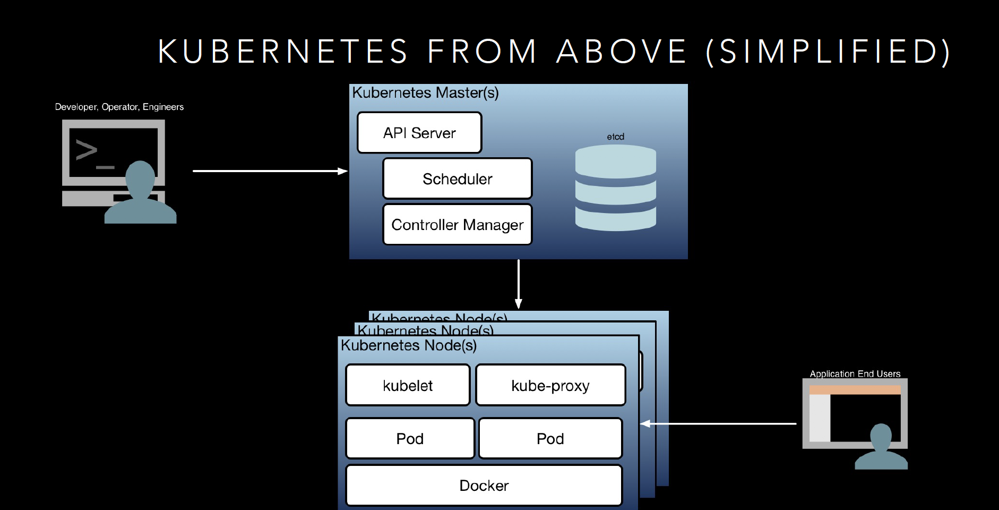

# kubernetes

Container types

Docker 
RKT
GARDEN
LXC
MESOS

# Orchestration 
CNCF Cloud Native Computer  Foundation
Azure  AWS EKS
kops recommended for EC2 
GCP Google Cloud

Minikube (linux or mac)
      Install kubectl
      Install minikube

Pod- instances of a container or groupings of containers. 
Services - endpoints expose ports 

# kubectl 

$ kubectl version
Client Version: version.Info{Major:"1", Minor:"13", GitVersion:"v1.13.3", GitCommit:"721bfa751924da8d1680787490c54b9179b1fed0", GitTreeState:"clean", BuildDate:"2019-02-04T04:49:22Z", GoVersion:"go1.11.5", Compiler:"gc", Platform:"darwin/amd64"}
Unable to connect to the server: dial tcp 192.168.99.106:8443: i/o timeout

#minikube
##Start minikube
• Deploy a sample Kubernetes “deployment” to your local minikube
• Expose this deployment to an external network
• List the “pods” of this deployment
• Access the sample service
• Delete the deployment
• Stop minikube
## DEMO: BASIC MINIKUBE COMMANDS
$ minikube start
### MINIKUBE SETUP
$ kubectl run hello-minikube --image=gcr.io/google_containers/echoserver:1.4 --port=8080
$ kubectl expose deployment hello-minikube --type=NodePort
$ kubectl get pod
$ curl $(minikube service hello-minikube --url) //Get the service URL
$ kubectl delete deployment hello-minikube
$ minikube stop

curl -Lo minikube https://storage.googleapis.com/minikube/releases/v0.23.0/minikube-darwin-amd64 && chmod +x 
minikube && sudo mv minikube /usr/local/bin/
minikube start
kubectl run hello-minikube --image=gcr.io/google_containers/echoserver:1.4 --port=8080
kubectl expose deployment hello-minikube  --type=NodePort
kubectl get pod
curl $(minikube service hello-minikube --url)
kubectl delete deployment hello-minikube
minikube stop

#Tomcat
kubectl expose deployment tomcat-deployment  --type=NodePort
TomcatDeployment jjacob151$ kubectl apply -f ./deployment.yaml 
kubectl expose deployment tomcat-deployment --type=NodePort
service/tomcat-deployment exposed
minikube service tomcat-deployment --url
http://192.168.99.106:30928

### Trouble Shooting

Unable to connect to the server: dial tcp 192.168.99.100:8443: i/o timeout

Solution:

Ensure minikube is up before running any kubectl command

check the minikube status: minikube status

start minikube: minikube start

### Describe container: 
kubectl describe pods
kubectl describe pods tomcat-deployment-5c4b9b9c99-j422g

### kubectl Port-Forward

kubectl port-forward<pod Name>[LOCAL_PORT:RemotePort]
kubectl port-forward tomcat-deployment-5c4b9b9c99-j422g 5000:6000

### kubectl Attach

Attaches to a running process in an existing container

kubectl attach tomcat-deployment-5c4b9b9c99-j422g

### kubectl exec

Attaches to a running process in an existing container

kubectl exec -it  tomcat-deployment-5c4b9b9c99-j422g bash

### kubectl label pods

Update the labels

kubectl label pods  tomcat-deployment-5c4b9b9c99-j422g helathy=false

### kubectl run

Run an image on a cluster

kubectl run hazelcast --image=hazelcast/hazelcast --port=5701  

kubectl reference: https://kubernetes.io/docs/user-guide/kubectl/v1.8/

kubectl cheat sheet: https://kubernetes.io/docs/user-guide/kubectl-cheatsheet/

# List of Commands
kubectl get pods
kubectl get pods [pod name]
 
kubectl expose <type name> <identifier/name> [—port=external port] [—target-port=container-port [—type=service-type]
kubectl expose deployment tomcat-deployment --type=NodePort
 
kubectl port-forward <pod name> [LOCAL_PORT:]REMOTE_PORT]
 
kubectl attach <pod name> -c <container>
 
kubectl exec  [-it] <pod name> [-c CONTAINER] — COMMAND [args…]
kubectl exec -it <pod name> bash
 
kubectl label [—overwrite] <type> KEY_1=VAL_1 ….
kubectl label pods <pod name> healthy=fasle
 
kubectl run <name> —image=image
kubectl run hazelcast --image=hazelcast/hazelcast --port=5701
#### the hazelcast docker image has been moved to hazelcast/hazelcast (https://hub.docker.com/r/hazelcast/hazelcast

 
kubectl describe pod

We are happy to offer a $15 discount to our existing students for all our other Udemy courses.

The Complete Docker Course for DevOps and Developers ($15, Udemy Best Seller in Docker category)

Apache Spark with Java - Mastering Big Data! ($15, Udemy Best Seller in Apache Spark Category)

Apache Spark with Scala - Learn Spark from a Big Data Guru($15, Udemy Best Seller in Apache Spark Category)

IntelliJ IDEA Tricks to Boost Productivity for Java Devs ($15)

If you want more discounts, you can join our mailing li